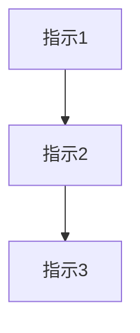

# 会話履歴からの指示抽出と整理

## タスク
会話履歴全体を分析し、ユーザーからのすべての指示、要求、タスクを抽出して体系的に整理する。結果をファイルに出力し、ファイルパスを提供する。

## 出力形式
### 1. 指示一覧
各指示を時系列順にリスト化：
- **[タイムスタンプ/順序]** 指示内容（原文の要約）
  - 目的：その指示が何のためのものか
  - 状況：完了/進行中/未着手

### 2. カテゴリ別整理
以下の側面で指示を分類：
- **メインタスク**：主要な作業指示
- **サブタスク**：関連する詳細指示
- **制約事項**：従うべき規則と条件
- **出力要件**：フォーマット仕様

### 3. 依存関係マップ

### 4. 実装サマリー
- **完了項目**：実施済みの内容
- **残存項目**：実施が必要な内容
- **ブロック項目**：進行できない項目とその理由

## 実行プロセス
1. 会話履歴全体を読み取り
2. すべてのユーザー指示を抽出
3.関係性と依存関係を分析
4. 整理されたサマリーを生成
5. ファイルに保存（パス：CLAUDE/summaries/YYYY-MM-DD_HH-mm-ss_summary.md）
6. ユーザーにファイルパスを返却

## 注意事項
- 明示的・暗示的指示の両方を含める
- 元の指示への変更や更新を記録
- 重要な要件と制約を強調
- 潜在的な競合や曖昧さを特定

## 出力言語
- サマリーファイルは日本語で記述
- 明確で専門的な日本語を使用
- 技術用語は適切な場合は英語のまま使用可能